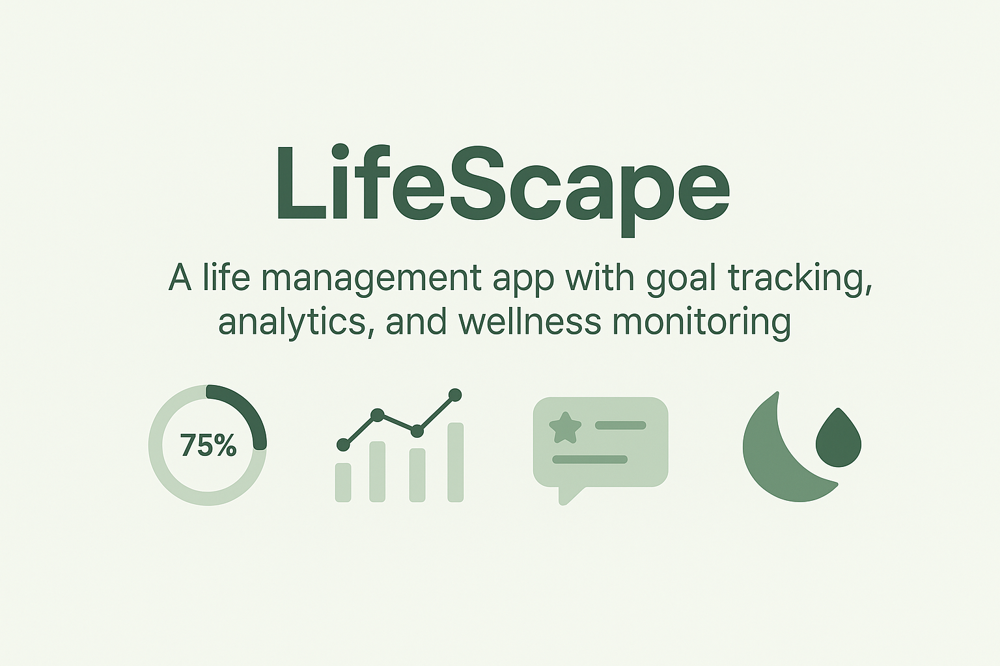
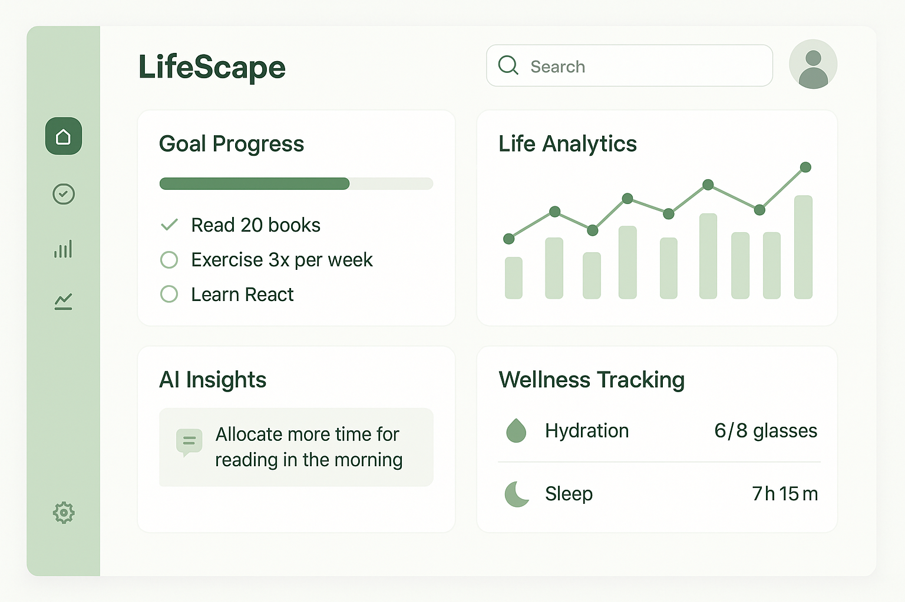

# 🌿 LifeScape — Redesigning the Way You Live

LifeScape is your personal **life optimization hub**, designed to help you take control of your time, habits, mental clarity, and productivity through a **beautiful, AI-powered dashboard**.

> "A life well designed is a life well lived."

 <!-- Placeholder: Add a project banner here -->

---

## ✨ Key Highlights

* ✅ **Goal Tracking:** Set, monitor, and achieve your personal & professional goals
* 📊 **Life Analytics:** Visualize how you spend your day, week, or month
* 🧠 **AI-Powered Insights:** Get intelligent suggestions on improving your lifestyle
* 🌙 **Wellness Modules:** Monitor sleep, hydration, mental health
* 🔐 **Private by Design:** Local-first with optional encrypted cloud sync
* 👥 **Community Layer (Coming Soon):** Connect with like-minded people

---

## 🗭️ Project Vision

> LifeScape isn’t just a productivity tool. It’s a philosophy.
> An intelligent companion that evolves with you — helping you become the **best version of yourself**, one insight at a time.

Whether you're a student, a professional, or a lifelong learner — LifeScape empowers you to reflect, plan, and grow holistically.

---

## 🛠️ Tech Stack

| Layer              | Tech Used                               |
| ------------------ | --------------------------------------- |
| **Frontend**       | React.js, TailwindCSS, Recharts         |
| **Backend**        | Node.js, Express.js                     |
| **Database**       | MongoDB (Mongoose ODM)                  |
| **AI Services**    | IBM watsonx, GPT-4o (Planned)           |
| **Authentication** | JWT, bcrypt                             |
| **Deployment**     | Vercel (Frontend), Render/AWS (Backend) |
| **Design Tools**   | Figma, Excalidraw                       |

---

## 📸 UI Preview

<!-- Replace with actual screenshots or gifs -->

<p align="center">
  
</p>

---

## ✨ Features In-Depth

### ⚖️ Goal Designer

* Set SMART goals (Specific, Measurable, Achievable, Relevant, Time-bound)
* Automatic progress tracking
* Streaks & accountability widgets

### 🎓 Focus & Study Mode

* Pomodoro timer with deep work mode
* App-blocker integration (Planned)
* Focus music (Spotify API integration coming soon)

### 🤔 Life Insights Engine

* AI-based suggestions on optimizing sleep, work, diet
* Detect burnout patterns and recommend healthy routines

### 📱 Mobile & Desktop Widgets

* Always-on-top tracker for daily metrics
* Lightweight, customizable productivity overlay

---

## 📚 Getting Started

### 1. Clone the repo

```bash
git clone https://github.com/sukanyaghosh74/lifescape.git
cd lifescape
```

### 2. Install dependencies

```bash
# Frontend
cd client
npm install

# Backend
cd ../server
npm install
```

### 3. Configure Environment

* Create `.env` files in `client/` and `server/` using the provided `.env.example`

### 4. Run Dev Servers

```bash
# In separate terminals:
npm run dev     # for client
npm run start   # for server
```

---

## 🌟 Contributing

We welcome contributions that align with the core values of LifeScape:

* Holistic wellness
* Privacy-first design
* Ethical use of AI

### To Contribute:

1. Fork the repo
2. Create a new branch: `git checkout -b feature/your-feature-name`
3. Commit your changes: `git commit -m "Add your message here"`
4. Push to the branch: `git push origin feature/your-feature-name`
5. Create a Pull Request

---

## 🌍 Roadmap

* [x] Core dashboard with goal analytics
* [x] AI-based insights module (MVP)
* [ ] Encrypted cloud sync
* [ ] Community support system
* [ ] Calendar & routine auto-suggestion engine
* [ ] Habit tracking mobile app

---

## 💼 License

This project is licensed under the **MIT License**. See the `LICENSE` file for more details.

---

## 👤 Author

Made with 🩷 by [**Sukanya Ghosh**](https://github.com/sukanyaghosh74) ✨

> If you like this project, consider giving it a ⭐ to help others discover it.

---

## 📢 Feedback

We'd love to hear your thoughts, feature requests, or bug reports. Feel free to [open an issue](https://github.com/sukanyaghosh74/lifescape/issues) or drop a message!
